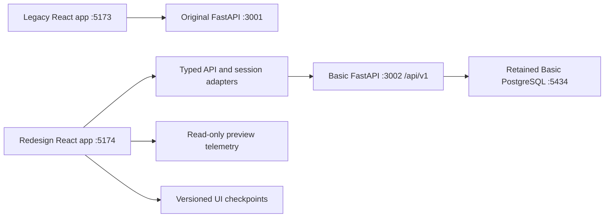

# CareSync interface redesign architecture

Status: active isolated development  
Runtime: `frontend-redesign` on `http://127.0.0.1:5174`  
Legacy runtime: unchanged on `http://127.0.0.1:5173`
Retained API/schema: `http://127.0.0.1:3002` /
`0039_admissions_decision_spine`

## Product direction

CareSync should feel like an original cinematic care-operations command system: deep-space depth, precise instrument color, subtle orbital motion, and calm information density. The visual language may be playful and futuristic, but operating decisions must remain obvious, accessible, and difficult to misuse.

The redesign is not a reskin. The current frontend is a behavioral specification. Each feature moves with its API adapter, state model, error states, checkpoints, safety gates, responsive behavior, accessibility, and tests.

## Non-negotiable boundaries

- The current frontend remains available until route and data-behavior parity is verified.
- The redesign owns its package, lockfile, routing, styling, storage namespace, tests, and build output.
- No legacy Tailwind CSS, contexts, or runtime components are imported into the redesign.
- The FastAPI service and existing database names remain unchanged.
- UI permission hiding is never treated as authorization.
- Fake or unfinished legacy screens are not presented as real features in the redesign.
- Scheduler visualization state can never authorize persistence or export.
- Reduced-motion, keyboard navigation, visible focus, semantic landmarks, and responsive layouts are baseline requirements.

## Runtime topology



Browser storage is origin-scoped. Port 5174 cannot and must not copy a bearer token or scheduler `sessionStorage` checkpoint from port 5173. A live session signs in separately.

## Frontend structure

```text
frontend-redesign/src/
  api/                 FastAPI transport and DTO boundaries
  auth/                independent identity + organization bootstrap
  components/
    brand/             CareSync mark and wordmark
    shell/             rail, header, command search, notices
    ui/                semantic styled-components primitives
  data/                typed route manifest and command aliases
  features/
    auth/              isolated session gateway
    dashboard/         live health + gated operational telemetry
    scheduling/        V3 visualization and state machine
    modules/           honest migration holding surface
    system/            errors and not-found routes
  hooks/               composed feature queries
  state/               small persistent UI state only
  styles/              typed tokens and global accessibility rules
```

Server data should move to a query cache as real feature adapters arrive. Zustand remains limited to shell and small client-only state. Scheduler workflow state is a typed reducer/state machine, not a collection of unrelated booleans.

## Visual system

- Brand base: existing CareSync plum, expanded with plasma violet, ion cyan, mint, amber, and coral semantic signals.
- Canvas: deep navy rather than pure black; glass surfaces retain visible borders and readable contrast.
- Typography: Comfortaa is reserved for brand/display moments. Dense operational text uses a legible system sans stack.
- Spacing: a 4px-derived scale; panels use 13–28px radii according to hierarchy.
- Motion: opacity and transform only for normal surfaces. Engine telemetry may animate progress and replay, with explicit pause/replay and reduced-motion support.
- Status never relies on color alone. Every signal includes text and/or an icon.

## Authentication contract

The new session adapter uses:

- `POST /auth/login`
- `GET /auth/me`
- `GET /organization`

Identity and organization bootstrap are intentionally independent. An invalid identity clears the token. A temporary organization-profile failure keeps the valid identity and reports degraded context instead of logging the user out.

Application-data requests require an authenticated identity, a non-null identity `organization_id`, and successfully loaded organization metadata whose `id` exactly matches that identity claim. A missing, failed, or mismatched organization bootstrap blocks operational reads instead of guessing the tenant boundary. The redesign token uses its own storage key and is never passed through a URL.

The current bearer token is kept in origin-local `localStorage` for compatibility with the existing API. That makes strict content-security policy, dependency hygiene, and XSS prevention release requirements; a future HttpOnly same-site cookie or short-lived access-token design would reduce browser-script exposure. Temporary identity-service failures retain the token for retry, while confirmed `401`/`403` identity failures clear it.

Backend authorization, refresh/revocation, invite activation, and safe JWT production configuration remain backend release blockers; the interface cannot solve them with visual permission gates.

## Scheduling safety model

The production workflow remains one vertical slice:

1. Select a generated or imported claim source.
2. Load closures and school-calendar policy.
3. Configure only parameters that V3 actually supports.
4. Generate exact deterministic placement.
5. Replay construction, repair, daycare redistribution, and constraint auditing.
6. Review a server-certified result.
7. Persist/export only when certification is complete and current.

Important contract facts:

- V3 rejects non-empty child time overrides; the redesign must not expose those controls as V3-compatible.
- `dailyCapacityMax` is a soft unique-child target, not a hard licensed capacity. `dailyCapacityMin` is not independently enforced.
- The database currently persists attendance rows but not V3 telemetry, warnings, input hash, algorithm version, or certification.
- Therefore historical database-only batches are certification-unknown and read-only in the redesign until schedule-run metadata is stored server-side.
- Generic attendance resources cap results at 5,000 rows; new history adapters must paginate.
- The interface simulation is explicitly read-only. Its checkpoint can demonstrate UX continuity but can never become production certification.

## Migration lanes

| Lane | Scope | Release requirement |
|---|---|---|
| Foundation | Tokens, shell, command search, API/session boundary, errors, responsive behavior | Build, browser QA, accessibility baseline |
| Command deck | Health, family/child stats, operational attention and activity | Authenticated org-scoped partial-error handling |
| Scheduling | Claims → configure → V3 replay → review → export | Contract validation, durable certification metadata, parity and safety E2E tests |
| Families + Children | Lists, details, registration, CSV import, medical/funding records | Shared typed entity/forms and draft recovery |
| Billing & Finance | Capability-gated `/billing` workspace with accounts, full historical `payer_versions`, rates, enrollment-scoped agreements, invoices, payments, allocations and credits, exact recovery, owner activation, readiness and canonical invoice rendering | Exact 0033/0036 protocol plus 0037 agreement scope, payer-version/guardian-pinned history, coherent snapshot paging, strict parser/arithmetic/provenance checks, distinct synthetic/private-manual presentation and no implication of processor/delivery |
| Admissions → Finance | One readiness projection on Admissions, Billing, Family and Child; family settlement plus child charge attribution | Strict tenant/action parsing, coherent realtime refresh, no child-level paid/outstanding invention and an actionable row for every unresolved active child |
| Jobs & Hiring | Employer ATS under `/ats`, candidate marketplace under `/marketplace`, shared lifecycle and realtime refresh | Canonical server/client adapters only; legacy hiring prefixes and retired invitation/handoff adapters remain absent |
| Organization + Settings | Real API-backed controls only | Backend authorization enforcement first for user administration |
| Documents + Activity | Letterhead and audit timeline | Export/print and pagination verification |
| Deferred | Mock files, subscription billing, privacy export, integrations, support submission, notifications | A real backend behavior must exist before redesign |

The legacy app is retired only after every real route in a lane passes data parity, responsive/browser QA, keyboard checks, and recovery/error scenarios.

The old `/invoicing/*` route is retired with reason and renders NotFound in
Basic. Revision 0033 preserves its strictly disposable synthetic sandbox;
revision 0036 adds a separate private/local manual boundary that requires an
explicit owner activation. The frontend never treats server allowlisting as
activation and never relabels synthetic facts as manual. Its printable
canonical invoice record is a local browser rendering, not delivery, a tax
receipt or payment evidence. No mode provides a processor, money movement,
automatic issue, refund, tax/funding authority or parent portal.

Revision 0037 changes agreement uniqueness, not that 0036 protocol. Ordinary
agreements are enrollment-scoped; the legacy account/child fallback applies
only to null-enrollment history. Revision 0038 leaves those billing semantics
unchanged and releases durable public-job catalog replay. The public stream
contains only the minimum safe projection/invalidation identity; candidate
screens still re-read canonical REST before displaying current jobs and never
trust the realtime event as record authority.

Revision 0039 leaves those earlier semantics unchanged and adds the full-route
administrator Admissions pipeline, waitlist, protected draft, non-PII register,
duplicate review, exact command recovery and conversion preview. The derived
existing-record remediation and enrollment-to-billing readiness projections
remain separately labelled.

The retained 0039 acceptance passed 125 administrator files / 841 tests, 272
staff-app tests and 78 extension tests, alongside 1,997 backend tests with 105
explicit opt-in skips, seven warnings and two independent green PostgreSQL 17
admissions runs. The signed-in retained Admissions read surfaces loaded without
a visible error or write. Product slice
`0040_billing_readiness_batch_planner` is verified in source and through
retained live read-only API acceptance. Its `/billing?view=setup` workspace
adds deterministic setup waves, no-write preview and exact guarded reuse of
canonical account, payer, rate and agreement commands. The signed-in
administrator browser-click walkthrough remains pending.
