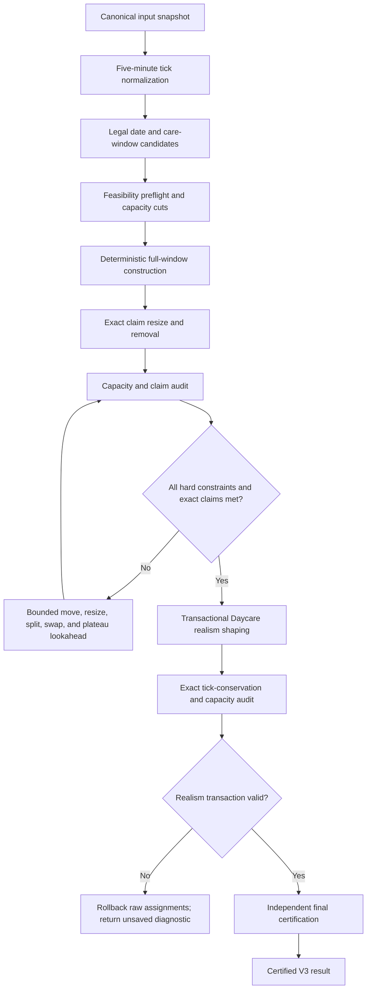

# Scheduler V3 Architecture

## Purpose

V3 is an isolated, deterministic scheduling engine. It converts normalized claim hours
into legal five-minute attendance assignments, then independently certifies the result.
It does not read or write the application database.

## Pipeline

## Hard constraints

- All durations and times are integer five-minute ticks.
- Daycare may use the configured operating window, normally 07:00–18:00.
- OSC school days may use 07:00–08:30 and 15:30–18:00.
- OSC school-off days may use the configured full operating window.
- A child may have at most one assignment per eligible date.
- Enrollment dates and excluded dates are enforced.
- Simultaneous occupancy at every tick must not exceed licensed capacity.
- No child may exceed the normalized claim.
- A result is exact only when every child receives every requested tick.
- A final shaped Daycare assignment may not exceed nine hours (108 ticks) on one date.
- Daycare shaping must conserve every child's exact claim ticks; it may not borrow from or
  lend time to another child.

## Daycare realism transaction

Realism shaping runs only after the raw allocator reaches exact claim fulfillment. It
does not participate in proving whether the original claim hours can fit the legal care
windows.

For each Daycare child, V3 composes a seeded set of daily durations that normally fall
between six and nine hours, with at most one shorter mathematical remainder when needed.
It then places those durations around a child-stable seeded arrival anchor with small
date-level jitter. All values remain integer five-minute ticks; displayed decimal hours
are derived values only.

Placement uses a bounded deterministic fallback ladder. It first tries the fewest
realistic attendance days, then retries with progressively more six-to-nine-hour days
when longer blocks cannot fit around fixed OSC occupancy. This avoids treating a failed
nine-hour-heavy layout as proof that a shorter-day layout is impossible.

Every day-count rung first tries the requested seeded appearance, then three
seed-independent rescue layouts using canonical center, early, and late arrival anchors.
Constrained children are ordered by remaining eligible-date slack and longer blocks are
placed before short remainders. These rescues are bounded heuristics—not a mathematical
proof that every possible packing has been enumerated—so exhaustion remains an explicit
non-persistable `proven=false` result.

The transaction removes the raw Daycare assignments into a private working state,
preserves OSC occupancy, and places the shaped assignments only on eligible dates with
per-tick capacity. The new state commits only when all children remain exact and every
hard constraint passes. If placement fails, V3 restores the untouched raw assignments,
marks the realism phase as rolled back, and makes the result non-persistable.

The seed is part of the reproducibility contract: identical normalized input and seed
produce the same shaped attendance. Changing an explicitly approved seed may produce a
different valid realistic distribution.

## Objective order

1. Zero hard violations.
2. Zero total claim shortfall.
3. Minimize the worst individual shortfall while repair is incomplete.
4. Optimize soft daily unique-child distribution without reducing claim fulfillment.
5. Apply a canonical tie-break so identical inputs always produce identical output.

Soft targets never participate in the construction decision that determines whether
claims can be fulfilled.

## Result states

- `feasible=true, proven=true`: exact claims and all hard constraints independently pass.
- `feasible=false, proven=true`: a sound capacity/window proof demonstrates infeasibility.
- `feasible=false, proven=false, SEARCH_BUDGET_EXHAUSTED`: bounded repair ended before its
  search space was exhausted. This is not an infeasibility proof.
- `feasible=false, proven=false, SEARCH_EXHAUSTED`: the implemented repair neighbourhood
  was exhausted, but the general scheduling problem was not mathematically disproved.
- `feasible=false, proven=false, DAYCARE_REALISM_PLACEMENT_FAILED`: raw exact assignments
  were found, but the nine-hour Daycare realism transaction could not be placed without
  violating capacity or eligibility. The raw state is returned only as an unsaved
  diagnostic.

## Certification boundary

The independent auditor does not call the scheduler or its candidate helpers. It
recomputes legal dates, care windows, block shape, per-tick occupancy, claims, totals,
capacity peaks, feasibility metadata, and objective metadata from immutable inputs.
Only an independently valid exact result may be exposed as certified.

## Rollout and integration gate

V3 is the default backend scheduler. The API translates its independently audited
five-minute assignments through the legacy response contract, so review, persistence,
and export consumers continue to receive the established entry shape. Incomplete V3
results may be returned as diagnostics but are refused before database persistence.

`SCHEDULER_ENGINE_VERSION=v2` remains available only as a deprecated emergency rollback.
New development and normal operation must use the default `v3`; the V2 path receives no
new scheduling features and should be removed after the V3 rollout observation period.

The V3 release gate includes:

- adversarial move/resize/split/swap and plateau-chain fixtures;
- exact-oracle comparison on exhaustive small cases;
- deterministic replays across input permutations;
- real-shaped feasible and infeasible performance tests;
- the existing scheduler regression suite.
